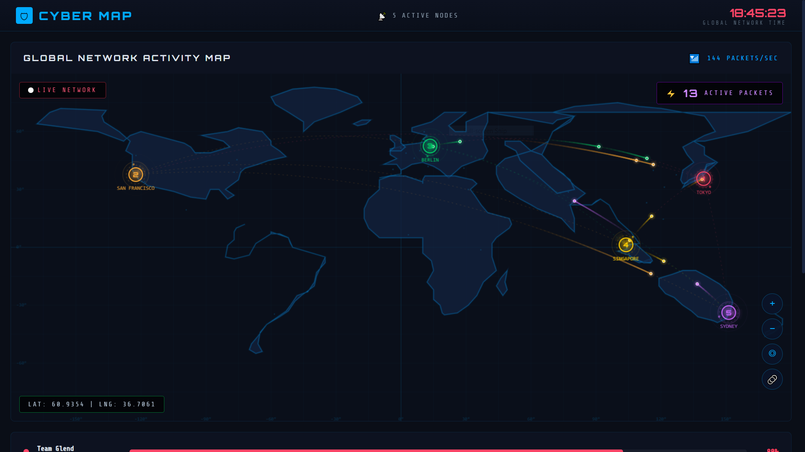
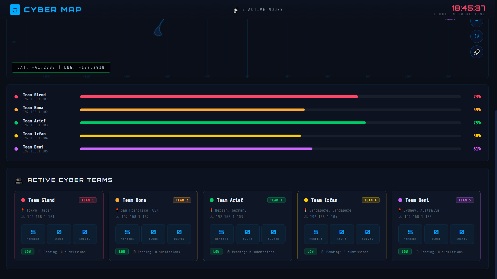

<div align="center">

# 🛡️ PingBox

### Cyber Network Monitoring & Web Service Logger

[](https://go.dev/)
[](LICENSE)
[]()

*A real-time cyber map dashboard with virtual host logging capabilities, built with Go and vanilla JavaScript.*

</div>

---

## 📸 Screenshots

### Global Network Activity Map
> Interactive world map showing live network activity with animated packet routing between nodes.



### Dashboard & Team Monitoring
> Real-time team progress bars, active cyber team cards, and node statistics.



---

## 🚀 Features

- **🌍 Interactive Cyber Map** — Real-time world map visualization with animated network packets traveling between global nodes
- **📊 Team Progress Monitoring** — Track multiple cyber teams with live progress bars and percentage indicators
- **🃏 Active Cyber Team Cards** — Detailed team cards showing members, score, solved challenges, location, and IP address
- **⏱️ Global Network Time** — Live clock with millisecond precision displayed in the top bar
- **📡 Packet Tracking** — Monitor active packets/sec and total active packet count across the network
- **🔒 Virtual Host Routing** — Serve different pages based on hostname (e.g., `pacebook.com`, `klikbeca.com`, `login.hotspot`)
- **📝 Request Logging** — Comprehensive HTTP request logger that captures method, URL, headers, body, and remote address
- **🎨 Cyberpunk UI** — Dark theme with neon accents, glowing effects, and futuristic typography

## 🏗️ Architecture

```
pingbox/
├── main.go                  # Go HTTP server with virtual host routing & logging
├── go.mod                   # Go module definition
├── LICENSE                  # GPL-3.0 License
├── log.txt                  # Auto-generated request log file
├── docs/                    # Documentation assets
│   ├── screenshot-map.png
│   └── screenshot-dashboard.png
└── public/                  # Static files served per virtual host
    ├── localhost/            # Cyber Map dashboard (main UI)
    │   ├── index.html
    │   ├── main.js
    │   ├── assets/
    │   └── jsroot/           # ROOT JS visualization library
    ├── pacebook.com/         # Phishing page (Facebook clone)
    ├── klikbeca.com/         # Phishing page (BCA clone)
    └── login.hotspot/        # Captive portal login page
```

## ⚙️ How It Works

1. **Virtual Host Routing** — The Go server inspects the `Host` header and serves static files from the corresponding `public/<hostname>/` directory.
2. **Request Logging** — Any POST request to `/login.php` is fully logged (headers, body, IP) to `log.txt`, then the client is redirected to Google.
3. **Cyber Map Dashboard** — The `localhost` virtual host serves an interactive cyberpunk-themed dashboard with a world map, team monitors, and animated network traffic.

## 🛠️ Getting Started

### Prerequisites

- [Go 1.25+](https://go.dev/dl/)

### Installation

```bash
# Clone the repository
git clone https://github.com/n0z0/pingbox.git
cd pingbox

# Run the server
go run main.go
```

The server will start on **port 8080**.

### Usage

```bash
# Access the Cyber Map dashboard
open http://localhost:8080

# Test logging endpoint
curl -v -X POST -d "user=test&pass=test" http://localhost:8080/login.php

# Test with JSON payload
curl -v -X POST \
  -H "Content-Type: application/json" \
  -d '{"user":"test","pass":"test"}' \
  http://localhost:8080/login.php
```

### Virtual Hosts Setup (Optional)

To use virtual host routing, add entries to your hosts file:

```bash
# /etc/hosts (Linux/Mac) or C:\Windows\System32\drivers\etc\hosts (Windows)
127.0.0.1   pacebook.com
127.0.0.1   klikbeca.com
127.0.0.1   login.hotspot
```

Then access them via:
```
http://pacebook.com:8080
http://klikbeca.com:8080
http://login.hotspot:8080
```

## 📄 Log Output Example

```
--- [pacebook.com:8080] New Request ---
Timestamp: 2026-02-07T18:45:23+07:00
Method: POST
URL: /login.php
Remote Address: 192.168.1.100:54321
Headers:
  Content-Type: application/x-www-form-urlencoded
  User-Agent: Mozilla/5.0
Body:
  user=admin&pass=secret123
--------------------------
```

## 🧰 Tech Stack

| Component | Technology |
|-----------|------------|
| Backend   | Go (net/http) |
| Frontend  | HTML5, CSS3, Vanilla JavaScript |
| Map       | Custom Canvas/SVG with world-image asset |
| Visualization | JSROOT library |
| Font      | Orbitron, Share Tech Mono |

## ⚠️ Disclaimer

> **This project is created strictly for educational and authorized security testing purposes only.** The phishing page templates included are for demonstrating social engineering awareness in controlled environments (CTF competitions, security training). **Do NOT use this tool for unauthorized or malicious activities.** The author is not responsible for any misuse.

## 📜 License

This project is licensed under the **GNU General Public License v3.0** — see the [LICENSE](LICENSE) file for details.

---

<div align="center">

Made with ☕ by [n0z0](https://github.com/n0z0)

</div>
